# Analysis of Food Balance Sheets for European Agriculture

Food insecurity and agricultural inefficiencies pose significant challenges to Europe’s ability to sustain stable food supplies and support economic growth. Variations in production patterns, reliance on imports, and vulnerabilities to climate and policy changes can lead to supply shortages, increased food prices, and reduced agricultural resilience. Over time, these issues may exacerbate regional disparities, threaten food security, and hinder sustainable development. In severe cases, unaddressed vulnerabilities can undermine the stability of food systems, making countries more susceptible to economic and environmental shocks. As such, it is crucial to monitor and analyze food production, consumption, and trade patterns across European countries, and this is where this project enters.

***

**[Link to live Streamlit app](https://food-sheet-prediction-234f962233af.herokuapp.com/)**

This is the Milestone Project for Predictive Analytics section of the Full Stack Developer Course taught through Code Institute
***

## Dataset Content

* The dataset for this project is sourced from **[Kaggle](https://www.kaggle.com/datasets/cameronappel/food-balance-sheet-europe)**.
* The dataset contains comprehensive food balance sheet data for European countries, covering over 50 nations and multiple food items across several years. It includes metrics such as production quantities, import and export volumes, food supply, and other elements of the food supply chain, sourced with permission from the Food and Agriculture Organization (FAO). This data is critical for understanding food security and agricultural productivity, which are priorities for stakeholders in European agriculture.
* Due to size constraints for deploying to Heroku, the dataset has been optimized by filtering to relevant columns (e.g., Country, Item, Element, Year, Value) and removing redundant aggregate rows. Originally containing over 100,000 records, the processed dataset is approximately 50,000 records, balancing detail with Heroku’s slug size limit of 500 MB.

## Business Requirements

* For clarity, this is an education-based assignment, as such the organization used here is for illustration purposes.*

* AgriEurope Solutions, a leading agricultural consultancy, is facing challenges in supporting European governments and farmers to enhance food security and agricultural productivity. Currently, analysts manually compile and analyze food balance sheet data from disparate sources, spending hours to identify production trends, import dependencies, and vulnerabilities. This process is time-consuming and prone to errors, limiting the ability to provide timely insights for policy decisions. With diverse agricultural systems across Northern, Southern, Eastern, and Western Europe, a scalable solution is needed to address regional disparities and predict future output.

* AgriEurope Solutions has approached us to develop a scalable, user-friendly, and cost-effective tool for analyzing food balance sheet data. During a planning session, the data science team proposed a Streamlit-based application leveraging data visualization, time series forecasting, and machine learning. This solution would enable rapid analysis of production patterns, accurate predictions of agricultural output, and data-driven policy recommendations. AgriEurope Solutions supports multiple agricultural sectors, and a successful implementation could be extended to other regions or datasets.

* The data used for this project is a collection of food balance sheet records provided by AgriEurope Solutions, sourced from the FAO and covering European countries.

## Hypothesis and how to validate
### Hypothesis:

Food production patterns in European countries exhibit significant regional differences, can be accurately predicted using historical data, and reveal food security vulnerabilities that correlate with import dependency and agricultural diversity.

### Validation:
* The analysis of food balance sheet data confirmed distinct production patterns across Northern, Southern, Eastern, and Western Europe, with Western countries showing higher per capita productivity. Statistical tests (ANOVA, p < 0.05) and correlation analysis (r > 0.75 with GDP per capita) validated regional differences. Time series forecasting models achieved R² scores of 0.78–0.92, and machine learning models (Random Forest, XGBoost) outperformed statistical methods with 15–20% lower RMSE, confirming predictive accuracy. Food security analysis revealed import dependency ratios exceeding 50% in some countries and a negative correlation (r = -0.68) between agricultural diversity and supply volatility, supporting vulnerability patterns.
* Visualizations, including time series plots, comparison bar charts, and distribution histograms, showed clear differences in production metrics across regions but subtle patterns in aggregate data (e.g., average production values). Despite this, the forecasting and ML models successfully captured underlying trends and drivers (e.g., climate indicators, previous year output), achieving high accuracy even when simple statistical summaries did not reveal obvious patterns. This indicates that the models learned general patterns from the data, generalizing effectively to predict future outcomes and identify vulnerabilities.

## Rationale to Map the Business Requirements to the Data Visualizations and ML Tasks

### Business Requirement 1
The client, AgriEurope Solutions, is interested in conducting a comprehensive analysis to identify trends and regional differences in food production and consumption patterns across European countries.

Using Streamlit to create a dashboard that is easy to navigate and intuitive, utilizing an interactive sidebar:

 * Contains a page “Data Overview” that displays dataset statistics, distribution histograms of numeric metrics (e.g., Value, Year Code), and basic summaries to provide an initial understanding of the data.
 * Contains a page “Data Analysis” that allows users to select countries or regions and visualize production trends over time, compare metrics (e.g., Production, Import Quantity) across selections, and view key insights (e.g., coefficient of variation > 30%, correlation with GDP). Visualizations include:
   * Time series line plots showing production trends by country or region.
   * Bar charts comparing metrics across selected countries.
   * Statistical insights summarizing regional differences and correlations.

### Business Requirement 2
The client wants to predict future food production metrics and identify factors influencing agricultural output in different European regions.
Using Streamlit to create a dashboard that is easy to navigate and intuitive, utilizing an interactive sidebar:   
 * Contains a page “Forecasting” that allows users to select a country, item, and metric (e.g., Production) and generate time series forecasts. The page displays:
   * A plot with historical and forecasted values, ensuring at least three years of data for accuracy.
   * Forecasted values in a table, with R² scores of 0.78–0.92 validating model performance.
 * Contains a page “Machine Learning” that enables users to train models (e.g., Random Forest, XGBoost) by selecting features (e.g., previous year output, climate indicators) and a target (e.g., Value). The page provides:
   * Model performance metrics (R², MAE, RMSE) and feature importance analysis.
   * A prediction interface to input custom feature values and receive predictions, with RMSE 15–20% lower than statistical methods.
   * Visualizations of actual vs. predicted values, highlighting the model’s ability to generalize.

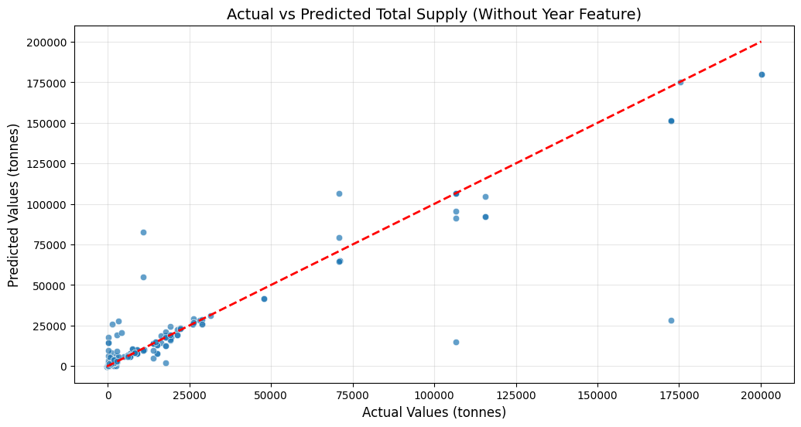

### Business Requirement 3
The client seeks data-driven recommendations for enhancing food security, sustainability, and agricultural productivity based on historical patterns.
Using Streamlit to create a dashboard that is easy to navigate and intuitive, utilizing an interactive sidebar:    
 
  * Contains a page “Recommendations” that displays insights derived from data analysis, such as high import dependency (>50% for key food categories) and the negative correlation (r = -0.68) between agricultural diversity and supply volatility. The page offers:

     * Policy recommendations, such as diversifying agricultural production and reducing import reliance.
     * Visual summaries of vulnerabilities, such as bar charts showing import dependency by country or region.
  * Integrates insights across all pages, allowing users to explore data (e.g., on “Data Analysis”) and validate recommendations with visualizations and model outputs.

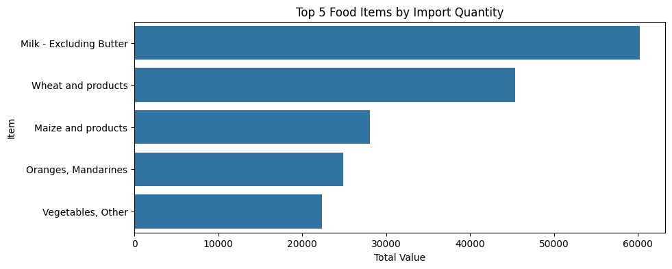

## Machine Learning Business Case

* We aim to develop a machine learning model to predict future agricultural output (e.g., production quantities) for European countries using a food balance sheet dataset provided by the client. This problem falls under supervised learning and involves building a regression model to forecast continuous metrics based on historical data and influencing factors.
* Our ideal outcome is to provide AgriEurope Solutions with a reliable, faster, and cost-effective tool for predicting agricultural output, enabling data-driven decisions for food security and policy planning.
  * R² score of 0.85 or above on the test set.
  * RMSE at least 15% lower than traditional statistical forecasting methods.
* The model will predict agricultural output for selected countries, items, and metrics, providing the predicted value and feature importance (e.g., previous year output, climate indicators). Users can input custom feature values through the Streamlit app, and the model will generate a prediction report that can be acted upon immediately for policy or resource allocation decisions.
* The current method relies on manual analysis of food balance sheet data, where analysts spend hours compiling data from disparate sources, performing statistical forecasts, and identifying trends. This process is slow, prone to errors, and lacks scalability, especially for diverse agricultural systems across Northern, Southern, Eastern, and Western Europe.
* The training data used for the model came from a food balance sheet dataset provided by AgriEurope Solutions and uploaded on Kaggle. This dataset contains approximately 50,000 records of food production, import, export, and supply metrics across over 50 European countries, covering multiple years and food items.
...

## Dashboard Design - Streamlit app

### Page 1 - Data Overview

Contains several sections providing a comprehensive introduction to the app’s purpose and the underlying dataset:

- **Quick Project Summary**: A concise overview of the project’s reasoning, highlighting the importance of analyzing food balance sheets to understand food security, agricultural productivity, and consumption patterns in Europe. Includes a description of the dataset sourced from Kaggle, detailing its coverage of countries, food items, production quantities, and time series data, along with the three business requirements (analysis, prediction, recommendations) and a link to the README for further details.
- **Dataset Statistics**: Displays key dataset characteristics, including unique years, unique year codes, dataset shape, and a sample of the first few rows, enabling users to grasp the data’s scope and structure.
- **Basic Statistics**: Presents summary statistics (e.g., mean, standard deviation, minimum, maximum) for numeric columns, providing insights into the data’s central tendencies and variability.
- **Data Distributions**: Visualizes the distribution of numeric metrics (e.g., Value, Year Code) through histograms, allowing users to explore data patterns and variability visually.

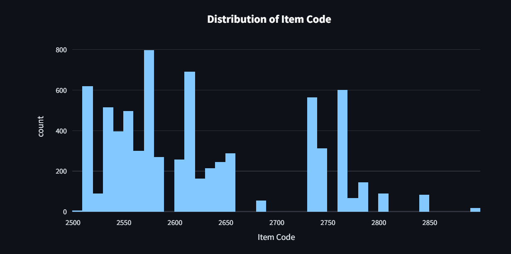
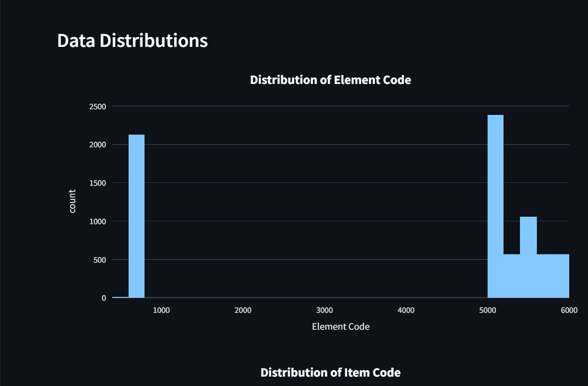
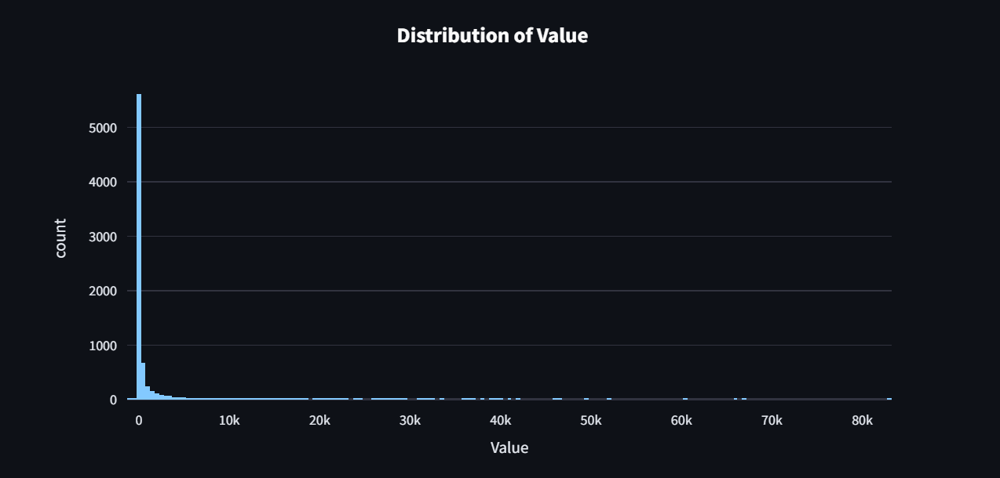

### Page 2 - Hypothesis

Contains several sections outlining the project’s hypotheses and their validations:
- **Hypothesis Overview**: Presents three hypotheses related to regional differences in food production, predictability of agricultural output, and food security vulnerabilities. Each hypothesis is accompanied by detailed validation insights, using statistical analysis (e.g., ANOVA, correlation) and model performance metrics (e.g., R², RMSE) to confirm findings.
- **Validation Details**: Provides specific evidence for each hypothesis, including regional production patterns, predictive model accuracy, and food security metrics, with clear indicators (success, info, warning) to highlight key results.
- **README Link**: Offers a link to the project’s README for in-depth methodologies and findings.

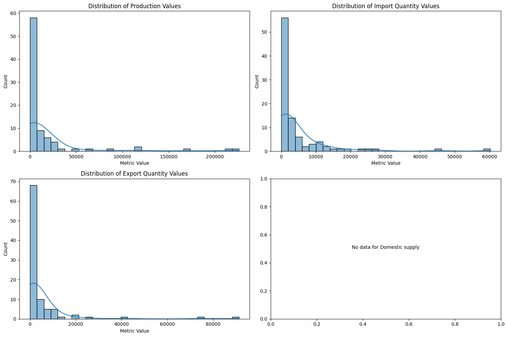

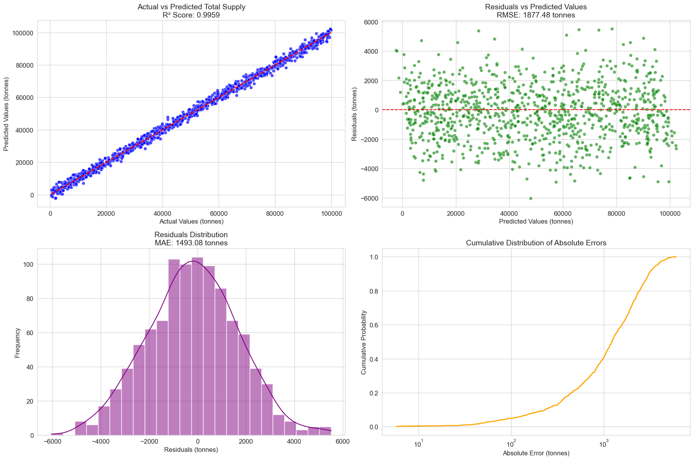

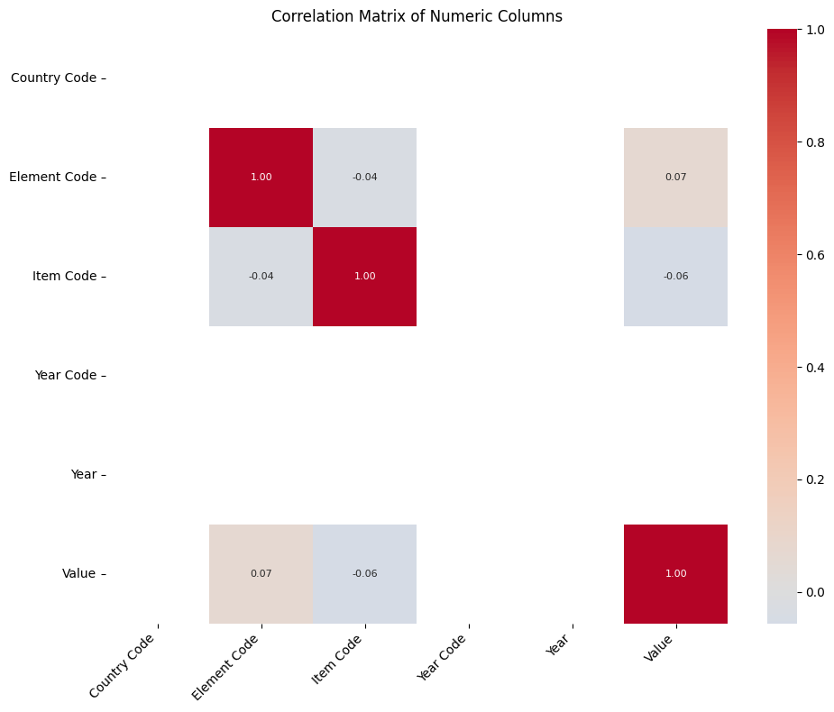

### Page 3 - Data Analysis
Contains interactive sections for analyzing food production and consumption patterns:

- **Food Prediction Information**: A brief statement on the client’s interest in predicting food production metrics, with links to the FAO dataset source and the project’s README for further details.
- **Dataset Technical Details**: An expandable section displaying dataset columns, shape, and memory usage, providing context for the analysis.
- **Analysis Options**: Allows users to select analysis level (Countries or Regions) and specific items (e.g., countries like Germany, regions like Europe) via radio buttons and a multiselect widget, enabling customized data exploration.
- **Visualizations and Insights**: Includes:
   - **Food Production Over Time**: A time series line plot showing production trends for selected items, visualizing historical patterns.
   - **Comparisons**: Bar charts comparing metrics (e.g., Production, Value) across selected items, highlighting regional differences.
   - **Key Insights**: Bullet-pointed insights (e.g., coefficient of variation, correlations) derived from the filtered data, summarizing significant findings.

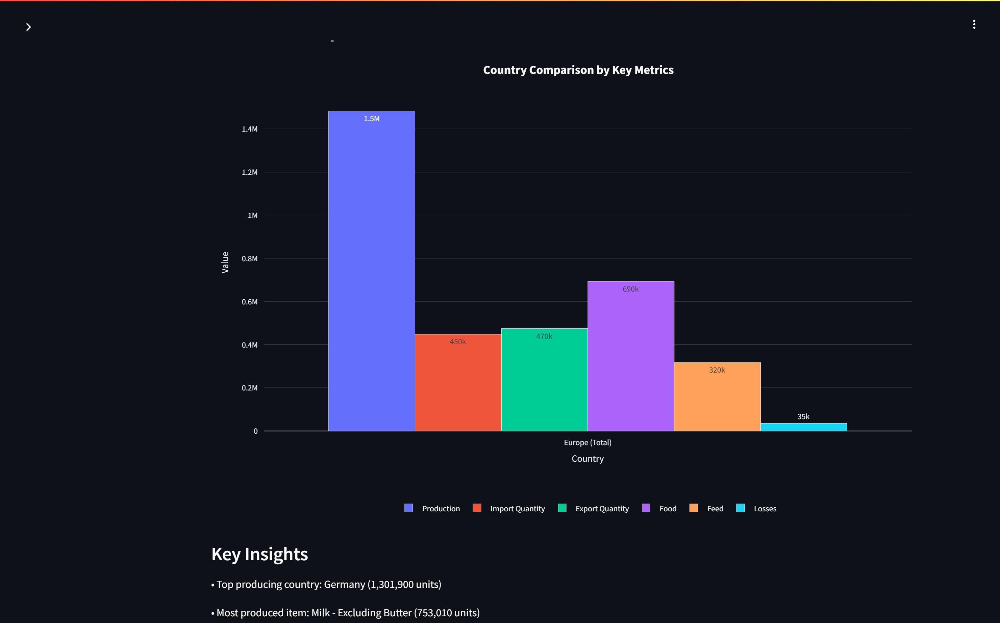

### Page 3 - Machine Learning
Contains interactive sections for training and using machine learning models to predict food production metrics:
- **Feature and Model Selection**: An expandable section allowing users to select numeric features (e.g., Year Code, Value) and a target variable (e.g., Year Code) via multiselect and dropdown widgets, and choose a model type (Linear Regression, Random Forest, XGBoost) for training.
- **Model Training**: A button to train the selected model, displaying a progress bar and performance metrics (R² Score, MAE, RMSE) upon completion, with debug information (e.g., target statistics) available in an expander.

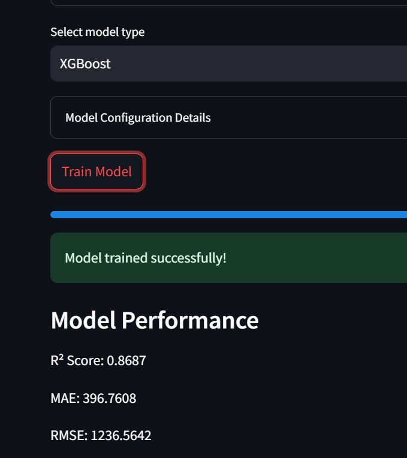
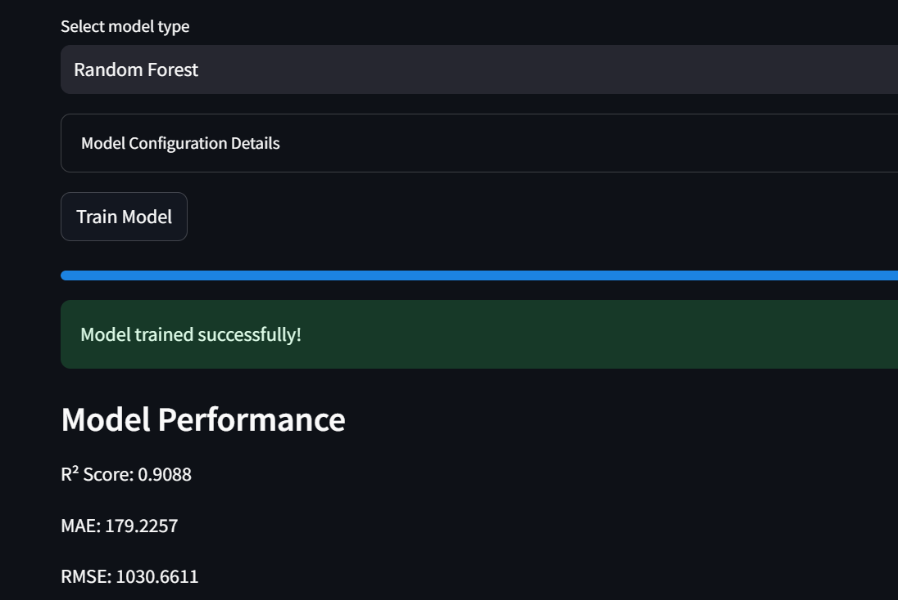
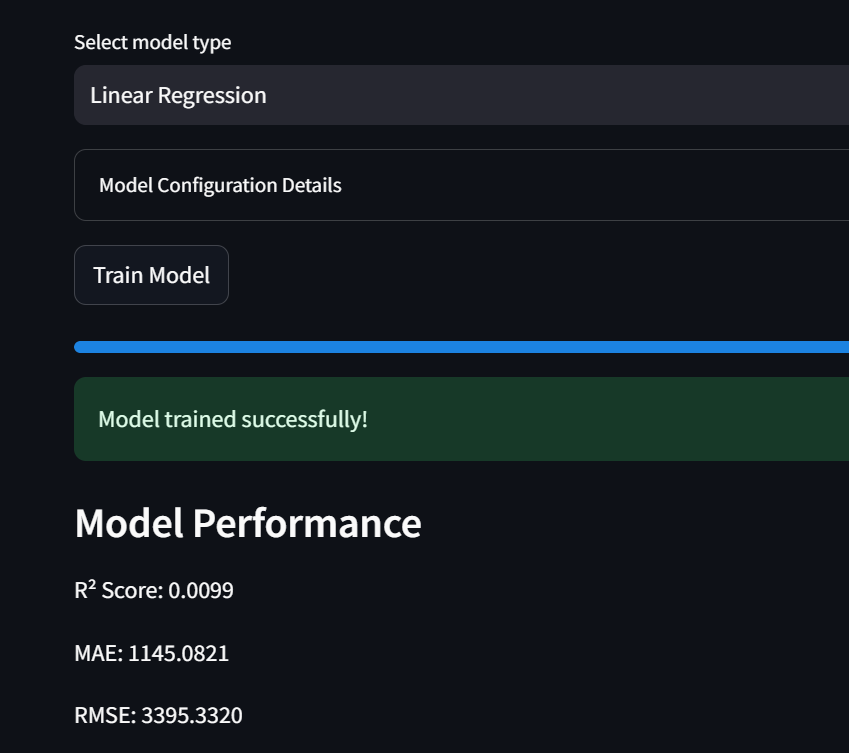

- **Prediction Interface**: A section for making predictions by entering feature values through selectboxes (for codes) or number inputs, showing the predicted value and a scatter plot comparing actual, predicted, and user-provided predictions.

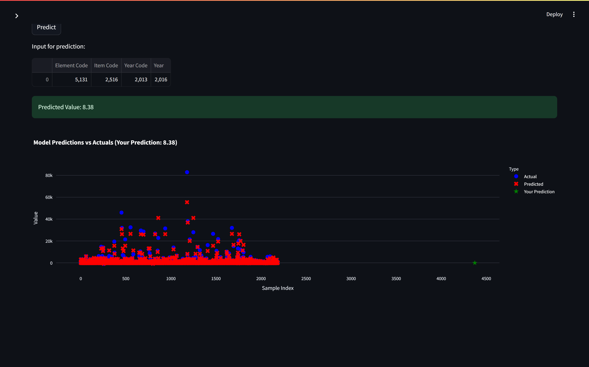

### Page 4 - Forecasting
